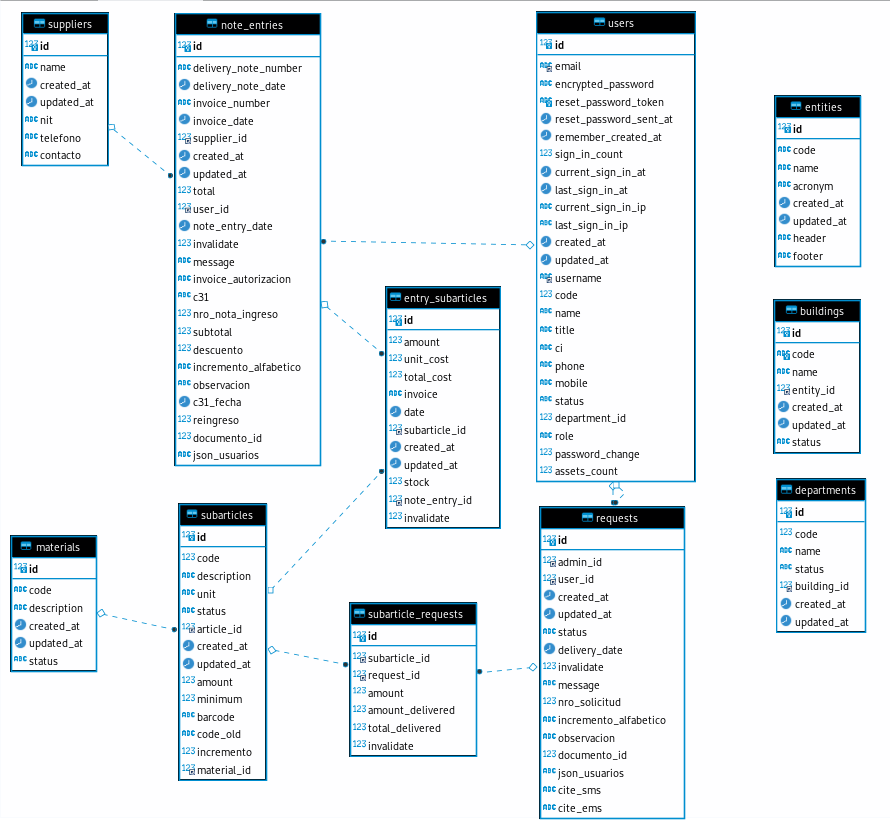

# SISTEMA DE ALMACENES
## MODELO ENTIDAD RELACIÓN DEL SISTEMA DE ALMACENES

## DICCIONARIO DE DATOS DEL SISTEMA DE ALMACENES

- ### **suppliers**
    Tabla para almacenar los **Proveedores** de artículos.

    | Columnas | Tipo y Tamaño | Descripción | 
    |----------|:-------------|------|
    | `id` | int(11) | Identificador de tabla |
    | `name` | varchar(255) | Nombre de proveedor |
    | `nit` | varchar(255) | NIT de proveedor |
    | `telefono` | varchar(255) | Teléfono de proveedor |
    | `contacto` | varchar(255) | Contacto de proveedor |
    | `created_at` | datetime | Fecha de creación de registro |
    | `updated_at` | datetime | Fecha de actualización de registro |
  
- ### **note_entries**
    Tabla para almacenar las **Notas de entrada**.

    | Columnas | Tipo y Tamaño | Descripción | 
    |----------|:-------------|------|
    | `id` | int(11) | Identificador |
    | `delivery_note_number` | varchar(255) | Número de nota de entrega |
    | `delivery_note_date` | date | Fecha de nota de entrega |
    | `invoice_number` | varchar(255) | Número de factura |
    | `invoice_date` | date | Fecha de la factura |
    | `invoice_autorizacion` | varchar(255) | Código de autorización de la factura |    
    | `supplier_id` | int(11) | Identificador del proveedor |
    | `user_id` | int(11) | Identificador del usuario encargado de crear la nota de ingreso |
    | `note_entry_date` | date | Fecha de la nota de ingreso |
    | `invalidate` | tinyint(1) | Campo para invalidar una nota ingreso |
    | `message` | varchar(255) | Campo para almacenar las razones para anular una nota de ingreso |
    | `c31` | varchar(255) | Campo referencial del código de proceso al que pertenece la compra |
    | `c31_fecha` | date | Campo referencial de la fecha del proceso al que pertenece la compra |
    | `nro_nota_ingreso` | int(11) | Número de nota de ingreso, el sistma asigna un número de manera automática |
    | `subtotal` | decimal(10,2) | Sumatoria de los precios sin tomar en cuenta el descuento de la nota de entrega |
    | `descuento` | decimal(10,2) | Descuento aplicado a la nota de entrega|
    | `total` | decimal(10,2) | Sumatoria de los precios tomando en cuenta el descuento de la nota de entrega |
    | `reingreso` | tinyint(1) | Campo que especifíca si la nota de ingreso es un regingreso |
    | `created_at` | datetime | Fecha de creación de la nota de ingreso |
    | `updated_at` | datetime | Fecha de actualización de la nota de ingreso |

  
- ### **users**
    Tabla para almacenar a los **Usuarios** y personas involucradas con el sistema.

    | Columnas | Tipo y Tamaño | Descripción | 
    |----------|:-------------|------|
    | `id` | int(11) | Identificador |
    | `email` | varchar(255) | Campo para almacenar la cuenta de correo electrónico |
    | `encrypted_password` | varchar(255) | Campo para almacenar la contraseña encriptada de los usuarios |
    | `sign_in_count` | int(11) | Campo para almacenar las veces que un usuario a iniciado sesión |
    | `current_sign_in_at` | datetime | Fecha y hora del actual inicio de sesión en el sistema |
    | `last_sign_in_at` | datetime | Fecha y hora de la último inicio de sesión en el sistema |
    | `current_sign_in_ip` | varchar(255) | Dirección IP de la actual sesión del sistema |
    | `last_sign_in_ip` | varchar(255) | Dirección IP de la ultima sesión del sistema |
    | `username` | varchar(230) | Nombre de usuario |
    | `code` | int(11) | Código de usuario |
    | `name` | varchar(230) | Nombres y Apellidos del usuario |
    | `title` | varchar(230) | Cargo de la persona dentro de la Institución |
    | `ci` | varchar(255) | Cédula de Identidad del usuario |
    | `phone` | varchar(230) | Telefono de referencia del usuario |
    | `mobile` | varchar(230) | celular de referencia del usuario |
    | `status` | varchar(2) | Campo para determinar si un usuario esta activo (1) o se encuentra dado de baja (0) |
    | `department_id` | int(11) | Campo para identificar la unidad a la que pertenece el usuario |
    | `role` | varchar(255) | Campo para almacenar el rol |
    | `password_change` | tinyint(1) | Campo que indica si el usuario a cambiado de contraseña |
    | `created_at` | datetime | Fecha y hora de creación del usuario |
    | `updated_at` | datetime | Fecha y hora de la actualización del usuario |

- ### **materials**
    Tabla para almacenar las **Categorias** de los artículos.

    | Columnas | Tipo y Tamaño | Descripción | 
    |----------|:-------------|------|
    | `id` | int(11) | Identificador |
    | `code` | varchar(50) | Codigo de categoría |
    | `description` | varchar(255) | Nombre o descripción de la categoría |
    | `status` | varchar(2) | Campo para determinar si una categoria esta activa (1) o se encuentra dada de baja (0) |
    | `created_at` | datetime | Fecha y hora de creación de la categoría |
    | `updated_at` | datetime | Fecha y hora de actualización de la categoría |

- ### **subarticles**
    Tabla para almacenar las **Articulos** del almacen.

    | Columnas | Tipo y Tamaño | Descripción | 
    |----------|:-------------|------|
    | `id` | int(11) | Identificador |
    | `code` | varchar(50) | Codigo de artículo |
    | `description` | varchar(255) | |
    | `unit` | varchar(255) | Tipo de unidad que se usa dentro del sistema de determinado subarticulo |
    | `minimum` | int(11) | Monto minimo de stock del artículo |
    | `code_old` | varchar(255) | Campo para de referencia de un código anterior |
    | `material_id` | int(11) | Identificador a la categoría que pertenece el artículo |
    | `status` | varchar(2) | Campo para determinar si una categoria esta activa (1) o se encuentra dada de baja (0) |
    | `created_at` | datetime | Fecha y hora de creación del artículo |
    | `updated_at` | datetime | Fecha y hora de actualización del artículo |

- ### **entry_subarticles**
    Tabla para almacenar las **items de ingreso** de las notas de ingreso, donde se almacenan la cantidad y precio.

    | Columnas | Tipo y Tamaño | Descripción | 
    |----------|:-------------|------|
    | `id` | int(11) | Identificador |
    | `amount` | decimal(10,4) | Cantidad de item que esta ingresando |
    | `unit_cost` | decimal(10,4) | Precio por unidad del item |
    | `total_cost` | decimal(10,2) | Costo total resultado de la multiplicación amount x unit_cost|
    | `date` | date | Fecha de ingreso |
    | `subarticle_id` | int(11) | Campo para identificar el artículo al que se hace referencia |
    | `note_entry_id` | int(11) | Campo para identificar la nota de ingreso a la que pertenece el item |
    | `invalidate` | tinyint(1) | Campo para determinar si un item esta activo (1) o se encuentra dado de baja (0) |
    | `created_at` | datetime | Fecha y hora de creación del item de la nota de ingreso |
    | `updated_at` | datetime | Fecha y hora de la actualización del item de la nota de ingreso |

- ### **requests**
    Tabla para almacenar las **solicitudes de salidas** de los items de articulos.

    | Columnas | Tipo y Tamaño | Descripción | 
    |----------|:-------------|------|
    | `id` | int(11) | Identificador |
    | `admin_id` | int(11) | Identificador del usuario que esta realizando la salida de items de artículos | 
    | `user_id` | int(11) | Identificador del usuario a quien se le está entregando los items de artículos |
    | `delivery_date` | datetime | Fecha y hora de la entrega |
    | `nro_solicitud` | int(11) | Número de entrega |
    | `observacion` | varchar(255) | Campo para registrar alguna observación relacionada a la solitud|
    | `status` | varchar(255) | Estado de la solicitud de salida que son: pending(pendiente), delivered(entregado)  canceled(cancelado) |
    | `invalidate` | tinyint(1) | Campo para determinar si una solicitud de salida está activo (1) o se encuentra dado de baja (0) |
    | `created_at` | datetime | Fecha y hora de creación de la solictud de salida |
    | `updated_at` | datetime | Fecha y hora de actualización de la solictud de salida |

- ### **subarticle_requests**
    Tabla para almacenar los **items de la solicitud de salida** de los items de articulos.

    | Columnas | Tipo y Tamaño | Descripción | 
    |----------|:-------------|------|
    | `id` | int(11) | Identificador |
    | `request_id` | int(11) | Identificador de solicitud a la que pertenece el item de salida |
    | `subarticle_id` | int(11) | Identificador de artículo al que pertenece el item de salida |
    | `amount` | int(11) | Cantidad de items solicitadas |
    | `total_delivered` | int(11) | Cantidad de items entregados |
    | `invalidate` | tinyint(1) | Campo para determinar si un item de salida está activo (1) o se encuentra dado de baja (0) |

- ### **departments**
    Tabla para almacenar los **Unidades organizacional de una Institución**.

    | Columnas | Tipo y Tamaño | Descripción | 
    |----------|:-------------|------|
    | `id` | int(11) | Identificador |
    | `code` | int(11) |  Código de Unidad Organizacional|
    | `name` | varchar(230) | Nombre de institución |
    | `status` | varchar(2) | Campo que determina sí una unidad organizacional está activa (1) o se encuentra dada de baja (0) |
    | `building_id` | int(11) | Identificador de  Institución |
    | `created_at` | datetime | Fecha y hora de creación del registro de Institución |
    | `updated_at` | datetime | Fecha y hora de actualización del registro de Institución |

- ### **buildings**
    Tabla para almacenar **Instituciones**.

    | Columnas | Tipo y Tamaño | Descripción | 
    |----------|:-------------|------|
    | `id` | int(11) | Identificador |
    | `code` | varchar(50) |  Código de institución |
    | `name` | varchar(230)| Nombre de insitución |
    | `entity_id` | int(11)| Identificador de la entidad a la que pertenece |
    | `status` | varchar(255) |  |    
    | `created_at` | datetime | Fecha y hora de creación del resgistro de institución |
    | `updated_at` | datetime | Fecha y hora de la actualización del registro de institución|

- ### **entities**
    Tabla para almacenar **Entidad**.

    | Columnas | Tipo y Tamaño | Descripción | 
    |----------|:-------------|------|
    | `id` | int(11) | Identificador |
    | `code` | varchar(50) | Codigo de Entidad |
    | `name` | varchar(230) | Nombre de entidad |
    | `acronym` | varchar(50) | Siglas de la Entidad |
    | `header` | varchar(255) | Nombre de archivo de imagen que se usa como cabecera de documentos |
    | `footer` | varchar(255) | Nombre de archivo de imagen que se usa como pie de página |
    | `created_at` | datetime | Fecha y hora de creación del registro de la entidad |
    | `updated_at` | datetime | Fecha y hora de actualización de la actualización |